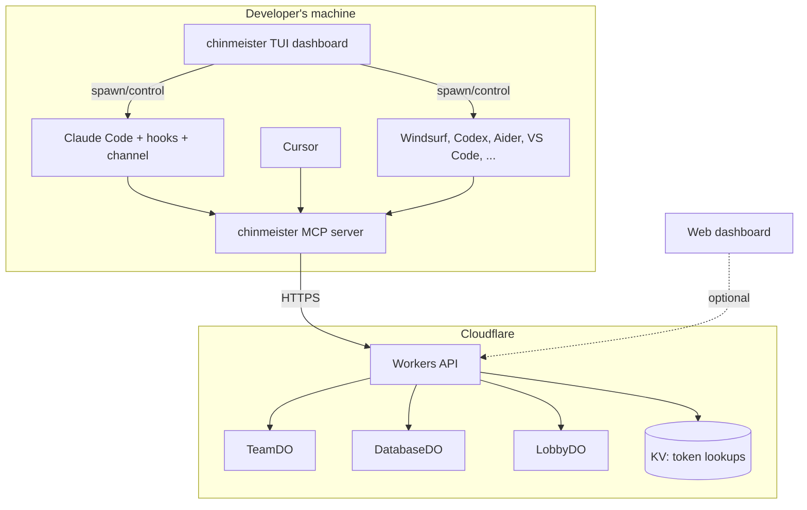

# Architecture

This document is the high-level map of chinmeister: what we are building, how the pieces fit together, and why we made the choices we did. Read it when you need orientation, not on every commit. It should be updated a few times per year, or when a section goes stale (then fix it or open an issue).

---

For product vision, positioning, ICP, and differentiation, see [VISION.md](VISION.md).

## How to read this doc

This document covers system design: how the pieces fit together, where code lives, and why we made the technical choices we did. The backend runs entirely on Cloudflare's edge. The primary interface is the MCP server that runs alongside each agent, not a CLI or GUI.

## System context

At a glance: AI tools on your machine talk to a local MCP server; that server talks to the worker over HTTPS; state lives in Durable Objects and KV is only for auth lookups. Humans can use the CLI or web dashboard, but agents are the main story. Managed CLI agents can be spawned and controlled by the TUI; connected IDE agents join via MCP and coordinate but manage their own lifecycle.



<details>
<summary>Plain-text diagram (same idea)</summary>

```
┌──────────────────────────────────────────────────────────────────┐
│                          chinmeister                                 │
│                                                                  │
│  Developer's machine                                             │
│  ┌────────────┐  ┌────────────┐  ┌────────────┐                    │
│  │ Claude Code │  │   Cursor   │  │  Windsurf  │  ...             │
│  │   + hooks   │  │ (connected)│  │ (connected)│  Codex, Aider    │
│  │   + channel │  │            │  │            │  (managed)       │
│  │  (managed)  │  │            │  │            │                  │
│  └──────┬─────┘  └──────┬─────┘  └──────┬─────┘                    │
│         │               │               │                        │
│         └───────┬───────┴───────┬───────┘                        │
│                 ▼               ▼                                 │
│         ┌─────────────────────────┐                              │
│         │   chinmeister MCP server    │  (one per agent connection)   │
│         │   reports activity     │                              │
│         │   checks conflicts     │                              │
│         │   reads/writes memory  │                              │
│         └───────────┬─────────────┘                              │
│                     │ HTTPS                                      │
│  ┌────────────┐     ▼                                            │
│  │ TUI dash   │──→ ┌──────────────────────┐                     │
│  │ [n] new    │    │  Cloudflare Workers  │                     │
│  │ [x] stop   │    │  (API + coordination)│                     │
│  └────────────┘    └──────────┬───────────┘                     │
│                    │                                              │
│          ┌─────────┴─────────┐                                   │
│          │  Durable Objects   │                                 │
│          │  TeamDO: coordination, memory, conflict detection     │
│          │  DatabaseDO: users, auth                             │
│          └─────────┬─────────┘                                   │
│          ┌─────────┴─────────┐                                   │
│          │  Cloudflare KV    │                                   │
│          │  (token lookups)  │                                   │
│          └───────────────────┘                                   │
└──────────────────────────────────────────────────────────────────┘
```

</details>

**AI agents** are the primary users. They interact with chinmeister through the MCP server that runs alongside each agent session. Developers interact with chinmeister indirectly: their agents are smarter because chinmeister is connected.

**The TUI dashboard** is the primary human control surface for managing agentic workflows. It shows all agents (managed and connected) in one place, supports messaging, memory management, and agent lifecycle control for managed agents.

**External dependencies** are limited to Cloudflare's platform: Workers (compute), Durable Objects (state), KV (auth lookups), and Pages (static hosting). No external databases, no Redis, no third-party APIs.

## Two-tier agent model

chinmeister supports two tiers of agent integration based on how much lifecycle control chinmeister has.

### Managed agents (CLI tools)

Claude Code, Codex, Aider, and other CLI-based AI agents. chinmeister can spawn these as child processes, track their lifecycle, and provide full control (start, stop, restart, message). When launched via `chinmeister run` or `[n]` in the TUI, chinmeister owns the process. Agents started independently still auto-connect via MCP and appear in the dashboard, but without process control.

### Connected agents (IDE tools)

Cursor, Windsurf, and other IDE-embedded agents. These join via MCP and get full coordination (shared memory, conflict detection, messaging, file locks). chinmeister cannot control their lifecycle — that's the IDE's domain. Control signals are advisory (messages the agent reads and follows).

### Docker Desktop analogy

chinmeister follows the Docker Desktop model: agents appear in the dashboard regardless of how they were started. You can run `claude "refactor auth"` from any terminal tab and it shows up in chinmeister. Or you can press `[n]` in the TUI to spawn one. Both work. chinmeister does not gate your workflow — it enhances it.

### Control mechanisms by tier

| Mechanism              | Managed (CLI)            | Connected (IDE)          |
| ---------------------- | ------------------------ | ------------------------ |
| Start/stop             | Process control          | N/A (IDE owns lifecycle) |
| Pause/resume           | Hook-based (Claude Code) | Advisory message         |
| Messaging              | Enforced delivery        | Via MCP context          |
| File locks             | Full                     | Full                     |
| Memory                 | Full                     | Full                     |
| Conflict detection     | Full                     | Full                     |
| Dashboard visibility   | Full                     | Full                     |
| Conversation analytics | Full (parsed from logs)  | Coordination data only   |

The dashboard shows both tiers in one unified list. Managed agents get stop/restart controls and full conversation analytics. Connected agents show activity and coordination data. The user does not need to understand the distinction for coordination to work.

## How agents connect

### Setup (one-time per project)

```
npx chinmeister init
```

This single command:

1. Creates an account (if first run): generates token, saves to the active profile config (`~/.chinmeister/config.json` for production, `~/.chinmeister/local/config.json` for local dev)
2. Creates a team for the project (or joins existing if `.chinmeister` file exists)
3. Writes MCP config files for all detected tools (driven by the shared registry in `packages/shared/tool-registry.ts`, re-exported through `packages/cli/lib/tools.ts`; the broader discover catalog lives in `packages/worker/src/catalog.ts` and is served by `GET /tools/catalog`):
   - `.mcp.json`: Claude Code, Codex, Aider, Amazon Q
   - `.cursor/mcp.json`: Cursor
   - `.windsurf/mcp.json`: Windsurf
   - `.vscode/mcp.json`: VS Code (Copilot, Cline, Continue)
   - `.idea/mcp.json`: JetBrains IDEs
4. For Claude Code: configures hooks (`.claude/settings.json`) and channel

The `.chinmeister` file is committed to the repo. When a teammate clones and runs `npx chinmeister init`, they auto-join the same team.

### Per-tool integration depth

| Tool                | Tier      | Integration                                      | How                                                                                                                                                         |
| ------------------- | --------- | ------------------------------------------------ | ----------------------------------------------------------------------------------------------------------------------------------------------------------- |
| **Claude Code**     | Managed   | Full: push alerts + enforced conflict prevention | Channels push real-time team state. PreToolUse hooks block conflicting edits. SessionStart hook injects team context. Process control when spawned via TUI. |
| **Codex CLI**       | Managed   | Basic: tool-based + process control              | MCP tools available. Process control when spawned via TUI.                                                                                                  |
| **Aider**           | Managed   | Basic: tool-based + process control              | MCP tools available. Shares `.mcp.json`. Process control when spawned via TUI.                                                                              |
| **Cursor**          | Connected | Good: pull-based awareness                       | MCP `instructions` field + tool descriptions guide the agent to check chinmeister. Lifecycle owned by IDE.                                                  |
| **Windsurf**        | Connected | Good: pull-based awareness                       | MCP tools + instructions. Same integration model as Cursor. Lifecycle owned by IDE.                                                                         |
| **VS Code Copilot** | Connected | Good: pull-based awareness                       | MCP tools + instructions. Also covers Cline and Continue extensions. Lifecycle owned by IDE.                                                                |
| **JetBrains**       | Connected | Basic: tool-based                                | MCP tools via `.idea/mcp.json`. Lifecycle owned by IDE.                                                                                                     |
| **Amazon Q**        | Connected | Basic: tool-based                                | MCP tools available. Shares `.mcp.json`.                                                                                                                    |

Claude Code gets the deepest integration because it supports hooks (enforceable interception before file edits), channels (server-initiated push), and is a CLI tool (process control). Other tools improve as their MCP implementations mature. Tool detection and MCP config writing are driven by a declarative shared registry (`packages/shared/tool-registry.ts`), surfaced through the CLI (`packages/cli/lib/tools.ts`); the broader discover catalog is maintained in the worker (`packages/worker/src/catalog.ts`).

## TUI as control surface

The TUI dashboard is the primary interface for managing agentic workflows:

- View all agents (managed + connected) in one unified list
- Send messages to individual agents or broadcast to the team
- Search and manage project memory
- Start new managed agents (`[n]` key or `chinmeister run`)
- Stop/restart managed agents (`[x]` key on managed agent rows)

The TUI does not replace each tool's native interface. Agents still run in their own terminals or IDEs. The TUI provides the unified view and control layer across all of them.

## Containers

The monorepo has five packages:

### `packages/mcp/`: MCP Server (the core product)

- **Technology:** Node.js, MCP SDK (stdio transport)
- **Entry point:** `index.js`
- **Responsibility:** The primary interface. Runs locally alongside each AI agent. Reports agent activity to the backend, checks for conflicts before file edits, reads/writes shared project memory. Exposes MCP tools and resources that agents use automatically.
- **Key constraint:** Never `console.log`. Stdio transport uses stdout for JSON-RPC. Use `console.error` for all logging.

### `packages/worker/`: Backend API

- **Technology:** Cloudflare Workers, Durable Objects (SQLite), KV, Workers AI, TypeScript
- **Entry point:** `src/index.ts` (HTTP router and auth middleware)
- **Responsibility:** Authentication, team coordination, shared memory storage, conflict detection, agent activity tracking. All business logic lives here.
- **Key constraint:** Stateless at the Worker level. All persistent state lives in Durable Objects. The Worker is a router that authenticates requests and forwards them to the appropriate DO.

### `packages/cli/`: TUI Dashboard + Setup + Process Management

- **Technology:** Node.js 22+, Ink (React for terminals), node-pty, esbuild, TypeScript
- **Entry point:** `cli.tsx` (screen router)
- **Responsibility:** Primary human control surface. Handles `chinmeister init`, `chinmeister add`, and `chinmeister run`. Agent operations dashboard (active agents, conflicts, shared memory, session history). Process management for managed CLI agents (spawn, track, stop, restart). Tool discovery screen.
- **Key constraint:** The CLI has no knowledge of Durable Objects, room IDs, or server internals. It speaks only the public HTTP/WebSocket API.

### `packages/shared/`: Shared Primitives

- **Technology:** Plain ESM modules shared across packages
- **Responsibility:** Canonical machine-facing definitions and helpers reused by CLI, MCP, web, and worker. Includes the shared tool registry, agent identity helpers, API client factory, and session-registry primitives.
- **Key constraint:** Shared code should stay infrastructural and dependency-light. It exists to eliminate duplicated sources of truth, not to become a grab bag.

### `packages/web/`: Web Dashboard + Landing Page

- **Technology:** React 19, Zustand, CSS Modules, Vite on Cloudflare Pages
- **Entry point:** `dashboard.html` (SPA), `index.html` (static landing page)
- **Responsibility:** Marketing and install instructions; authenticated dashboard at `/dashboard` for cross-project workflow, tool discovery, and team visibility. The web surface gives solo devs a unified view across all projects and gives team leads visibility into their team's AI workflow.
- **Key constraint:** Same API as TUI and MCP server. No special backend endpoints. The web dashboard is a client of the same public API.

## Code Map

### Worker (`packages/worker/src/`)

| File                          | Responsibility                                                                                                                                                                                                    |
| ----------------------------- | ----------------------------------------------------------------------------------------------------------------------------------------------------------------------------------------------------------------- |
| `index.ts`                    | HTTP router. Matches request paths to handlers. Runs Bearer token auth on protected routes via KV lookup. Bridges HTTP/WebSocket to Durable Objects. Hosts the tool catalog (`GET /tools/catalog`).               |
| `routes/`                     | Route handler modules by domain (`public.ts`, `team/*.ts`, `user/*.ts`). Handlers validate input, then delegate to DO RPC via middleware.                                                                         |
| `lib/middleware.ts`           | Shared route wrappers (`authedRoute`, `teamRoute`, `teamJsonRoute`) that factor out auth, team membership, JSON parsing, and DO error mapping.                                                                    |
| `lib/validation.ts`           | Input validation helpers (`requireString`, `validateTagsArray`, `withRateLimit`, `withTeamRateLimit`). Rate-limited paths go through atomic `checkAndConsume`.                                                    |
| `lib/http.ts`                 | JSON response helper + status mapping.                                                                                                                                                                            |
| `catalog.ts`                  | Discovery catalog served by `GET /tools/catalog`. Tool metadata for the Web/CLI tool browser.                                                                                                                     |
| `moderation.ts`               | Two-layer content filter. Layer 1: synchronous regex blocklist (under 1 ms). Layer 2: async AI moderation via Llama Guard 3. Used for status text and team names.                                                 |
| `dos/database/index.ts`       | `DatabaseDO`: single instance holding users, sessions, rate limits, and developer metrics. SQLite storage.                                                                                                        |
| `dos/database/pricing.ts`     | LiteLLM pricing snapshot, periodic refresh, and structural validation.                                                                                                                                            |
| `dos/database/evaluations.ts` | Stored evaluation records used by analytics.                                                                                                                                                                      |
| `dos/database/schema.ts`      | DatabaseDO schema + migrations.                                                                                                                                                                                   |
| `dos/team/index.ts`           | `TeamDO`: one instance per team. Class shell + WebSocket lifecycle + RPC wrappers.                                                                                                                                |
| `dos/team/schema.ts`          | TeamDO schema + migrations.                                                                                                                                                                                       |
| `dos/team/context.ts`         | Composite read queries (`getContext`, `getSummary`).                                                                                                                                                              |
| `dos/team/context-cache.ts`   | Class-based TTL cache for composite context reads.                                                                                                                                                                |
| `dos/team/identity.ts`        | Agent ID resolution and ownership verification.                                                                                                                                                                   |
| `dos/team/cleanup.ts`         | Stale-member eviction and data pruning.                                                                                                                                                                           |
| `dos/team/membership.ts`      | Team join, leave, and heartbeat logic.                                                                                                                                                                            |
| `dos/team/activity.ts`        | Agent activity tracking, file conflict detection, single-file edit reporting.                                                                                                                                     |
| `dos/team/sessions.ts`        | Session start, end, edit recording, outcome reporting, token + tool-call + commit capture.                                                                                                                        |
| `dos/team/memory.ts`          | Shared project memory: save, search, update, delete. Free-form tags, 500-memory cap with LRU pruning.                                                                                                             |
| `dos/team/categories.ts`      | Memory category promotion and management.                                                                                                                                                                         |
| `dos/team/locks.ts`           | File lock claim, release, and query.                                                                                                                                                                              |
| `dos/team/messages.ts`        | Inter-agent messaging: send and retrieve.                                                                                                                                                                         |
| `dos/team/conversations.ts`   | Conversation intelligence: store and query parsed messages from managed sessions. Sentiment tracking, topic classification, message length trends, sentiment-outcome correlation.                                 |
| `dos/team/commands.ts`        | Command queue for managed agents.                                                                                                                                                                                 |
| `dos/team/runtime.ts`         | Runtime metadata normalization for agent identity tracking.                                                                                                                                                       |
| `dos/team/websocket.ts`       | WebSocket lifecycle handlers extracted from the TeamDO class.                                                                                                                                                     |
| `dos/team/presence.ts`        | Presence helpers (online agents, heartbeat derivation).                                                                                                                                                           |
| `dos/team/broadcast.ts`       | Delta broadcast helpers used by the WS pipeline.                                                                                                                                                                  |
| `dos/team/telemetry.ts`       | Metric helpers (per-team counters, cleanup stats).                                                                                                                                                                |
| `dos/team/analytics/`         | 14 domain modules (`core`, `tokens`, `commits`, `conversations`, `outcomes`, `tool-calls`, `codebase`, `sessions`, `activity`, `memory`, `team`, `comparison`, `extended`, `index`) composing per-team analytics. |
| `lobby.ts`                    | `LobbyDO`: single instance tracking global presence (handle + country) and surfacing aggregate counts for the public `/stats` endpoint. Heartbeat-based presence with 60s TTL.                                    |

### MCP Server (`packages/mcp/`)

Three bin entries remain JS (`index.js`, `hook.js`, `channel.js`) because they're the process entry points; everything under `lib/` is TypeScript.

| File                        | Responsibility                                                                                                                                                                                                                                                                                                                                            |
| --------------------------- | --------------------------------------------------------------------------------------------------------------------------------------------------------------------------------------------------------------------------------------------------------------------------------------------------------------------------------------------------------- |
| `index.js`                  | MCP server entry point. Loads config and profile, creates the stdio server, and delegates tool/resource registration. Pull-on-any-call preamble.                                                                                                                                                                                                          |
| `hook.js`                   | Claude Code hook handler. Three modes: `check-conflict` (PreToolUse: blocks conflicting edits), `report-edit` (PostToolUse: reports file edits + session tracking), `session-start` (SessionStart: injects team context with stuckness insights).                                                                                                         |
| `channel.js`                | Claude Code channel server. Receives real-time delta events from TeamDO via WebSocket (watcher role), with 10s HTTP polling fallback when disconnected and 60s reconciliation safety net. Diffs state snapshots and pushes MCP notifications for joins, leaves, file activity, conflicts, stuckness (15min threshold), locks, messages, and new memories. |
| `lib/bootstrap.ts`          | Shared init/config loading used by index, hook, and channel.                                                                                                                                                                                                                                                                                              |
| `lib/auth.ts`               | Bearer token handling, refresh.                                                                                                                                                                                                                                                                                                                           |
| `lib/token-refresh.ts`      | Single-flight token refresh with inflight dedup and 401-retry.                                                                                                                                                                                                                                                                                            |
| `lib/api.ts`                | HTTP client with Bearer token auth, 10s fetch timeout, retry with exponential backoff on 5xx/network errors.                                                                                                                                                                                                                                              |
| `lib/team.ts`               | Team operation wrappers: delegates to backend API for join/leave, context, activity, memory, locks, messaging, and session/history endpoints.                                                                                                                                                                                                             |
| `lib/channel-ws.ts`         | WebSocket connection manager for channel. Connects as `role=watcher` to TeamDO, receives delta events, maintains local TeamContext via `applyDelta`. Ticket-based auth, exponential backoff reconnection.                                                                                                                                                 |
| `lib/channel-reconcile.ts`  | Periodic HTTP reconciliation. Fetches full context every 60s to catch drift; falls back to 10s polling when the WebSocket is disconnected.                                                                                                                                                                                                                |
| `lib/command-executor.ts`   | Executes commands dispatched from managed-agent control surfaces.                                                                                                                                                                                                                                                                                         |
| `lib/tools/index.ts`        | Tool registration orchestrator. Wires together all tool modules and registers them on the MCP server. Exports `withTeam` middleware for team-guarded tool handlers.                                                                                                                                                                                       |
| `lib/tools/team.ts`         | `chinmeister_join_team` tool implementation.                                                                                                                                                                                                                                                                                                              |
| `lib/tools/activity.ts`     | `chinmeister_update_activity` tool implementation.                                                                                                                                                                                                                                                                                                        |
| `lib/tools/conflicts.ts`    | `chinmeister_check_conflicts` tool implementation.                                                                                                                                                                                                                                                                                                        |
| `lib/tools/context.ts`      | `chinmeister_get_team_context` tool implementation.                                                                                                                                                                                                                                                                                                       |
| `lib/tools/memory.ts`       | Memory tools: `chinmeister_save_memory`, `chinmeister_search_memory`, `chinmeister_update_memory`, `chinmeister_delete_memory`.                                                                                                                                                                                                                           |
| `lib/tools/locks.ts`        | Lock tools: `chinmeister_claim_files`, `chinmeister_release_files`.                                                                                                                                                                                                                                                                                       |
| `lib/tools/messaging.ts`    | `chinmeister_send_message` tool implementation.                                                                                                                                                                                                                                                                                                           |
| `lib/tools/integrations.ts` | Integration-related tool registration.                                                                                                                                                                                                                                                                                                                    |
| `lib/tools/commits.ts`      | Commit-reporting tool implementation.                                                                                                                                                                                                                                                                                                                     |
| `lib/tools/outcome.ts`      | Outcome-reporting tool implementation.                                                                                                                                                                                                                                                                                                                    |
| `lib/tools/telemetry.ts`    | MCP telemetry helpers (`chinmeister_record_tokens`, `chinmeister_record_tool_call`).                                                                                                                                                                                                                                                                      |
| `lib/config.ts`             | Reads the active profile config (`~/.chinmeister/config.json` or `~/.chinmeister/local/config.json`) and the `.chinmeister` team file.                                                                                                                                                                                                                    |
| `lib/profile.ts`            | Auto-detects languages, frameworks, tools, and platforms from project files and environment variables.                                                                                                                                                                                                                                                    |
| `lib/context.ts`            | Shared context cache with TTL. Serves as preamble source and offline fallback when the API is unreachable.                                                                                                                                                                                                                                                |
| `lib/diff-state.ts`         | State diffing for the channel server. Compares team context snapshots and returns human-readable event strings for meaningful changes.                                                                                                                                                                                                                    |
| `lib/identity.ts`           | Re-exports agent identity helpers from shared package.                                                                                                                                                                                                                                                                                                    |
| `lib/lifecycle.ts`          | Session identity resolution and lifecycle management (start/end, terminal session tracking).                                                                                                                                                                                                                                                              |
| `lib/state.ts`              | Per-agent state accumulator for MCP tool calls prior to flush.                                                                                                                                                                                                                                                                                            |
| `lib/websocket.ts`          | WebSocket ticket fetch helpers.                                                                                                                                                                                                                                                                                                                           |
| `lib/utils/`                | Shared formatting, display, and response helpers used across tools and hooks.                                                                                                                                                                                                                                                                             |

### CLI (`packages/cli/`)

| File                                    | Responsibility                                                                                                                                                                                                                                                      |
| --------------------------------------- | ------------------------------------------------------------------------------------------------------------------------------------------------------------------------------------------------------------------------------------------------------------------- |
| `cli.tsx`                               | App shell with error boundary. Screen state machine: loading → welcome → {dashboard, customize, discover}. Loads/validates config on startup. Also handles pre-TUI commands (`init`, `add`, `run`, `doctor`, `token`).                                              |
| `lib/dashboard/index.tsx`               | Agent activity dashboard. Shows configured tools, active/offline agents (managed + connected), file conflicts, recent sessions, and team knowledge. Real-time updates via WebSocket with adaptive polling fallback (5s→60s). Managed agent controls (stop/restart). |
| `lib/dashboard/`                        | Supporting modules for the dashboard: context providers, reducer, input handling, sections, hooks, connection layer, and sub-views (sessions, memory, agent-focus).                                                                                                 |
| `lib/process-manager.ts`                | Spawns CLI agents via node-pty, tracks PIDs, handles kill/restart. Provides lifecycle events for dashboard integration.                                                                                                                                             |
| `lib/process/conversation-collector.ts` | Post-session conversation collector. Parses conversation logs from managed agent sessions (tool-specific parsers behind a generic interface) and uploads normalized events for conversation analytics.                                                              |
| `lib/discover.tsx`                      | Tool discovery screen. Shows your configured tools, recommends new tools from the catalog, browse by category, one-key add.                                                                                                                                         |
| `lib/commands/init.ts`                  | `chinmeister init`: account setup, team creation/join, tool detection via registry, MCP config + hooks writing.                                                                                                                                                     |
| `lib/commands/add.ts`                   | `chinmeister add <tool>`: adds a specific tool's MCP config. Fetches discovery catalog from API.                                                                                                                                                                    |
| `lib/commands/run.ts`                   | `chinmeister run`: spawn a managed agent and wire it into the dashboard.                                                                                                                                                                                            |
| `lib/commands/doctor.ts`                | `chinmeister doctor`: inspect and repair integration config.                                                                                                                                                                                                        |
| `lib/commands/token.ts`                 | Account token utilities.                                                                                                                                                                                                                                            |
| `lib/tools.ts`                          | CLI re-export of the shared MCP tool registry. Discovery catalog lives in the worker API (`GET /tools/catalog`).                                                                                                                                                    |
| `lib/mcp-config.ts`                     | Writes MCP config files for detected tools.                                                                                                                                                                                                                         |
| `lib/customize.tsx`                     | Profile editor. Change handle, cycle through 12-color palette, set status.                                                                                                                                                                                          |
| `lib/api.ts`                            | HTTP client. Wraps fetch with Bearer token auth, 10s timeout, retry with exponential backoff on 5xx/network errors.                                                                                                                                                 |
| `lib/colors.ts`                         | Maps chinmeister's 12 colors to ANSI terminal colors for Ink rendering.                                                                                                                                                                                             |
| `lib/config.ts`                         | Reads/writes the active profile config. Production uses `~/.chinmeister/config.json`; local dev uses `~/.chinmeister/local/config.json`.                                                                                                                            |

### Shared (`packages/shared/`)

| File                           | Responsibility                                                                                                                                                                           |
| ------------------------------ | ---------------------------------------------------------------------------------------------------------------------------------------------------------------------------------------- |
| `tool-registry.ts`             | Canonical source of truth for MCP-configurable tools: ids, names, detection, managed-launch metadata, availability checks, and discovery metadata.                                       |
| `agent-identity.ts`            | Tool detection, deterministic agent IDs, and per-session agent ID generation.                                                                                                            |
| `api-client.ts`                | Shared JSON API client factory used across surfaces. Configurable timeout, retry, and backoff.                                                                                           |
| `session-registry.ts`          | Terminal/session record helpers used for exact session identity and terminal attention.                                                                                                  |
| `contracts.ts` / `contracts/`  | Zod schemas + `z.infer` types for the API contract between packages. Files under `contracts/` split by domain (`team`, `analytics`, `conversation`, `dashboard`, `events`, `tools`).     |
| `dashboard-ws.ts`              | WebSocket delta event normalization and application. `applyDelta()` maintains a local `TeamContext` from server-pushed events. Used by CLI dashboard, web dashboard, and channel server. |
| `integration-doctor.ts`        | Detects and configures MCP/hooks across editors. Scans for host integrations, validates config, writes MCP and hook settings.                                                            |
| `integration-config-writer.ts` | Low-level writers for editor MCP config files.                                                                                                                                           |
| `integration-detector.ts`      | Detection helpers used by the doctor.                                                                                                                                                    |
| `integration-model.ts`         | Integration types + state machine.                                                                                                                                                       |
| `runtime-profile.ts`           | Runtime profile resolution (`production` vs `local`), config path selection.                                                                                                             |
| `config.ts`                    | Reads and validates the active profile config path.                                                                                                                                      |
| `team-utils.ts`                | Team ID validation and `.chinmeister` file discovery.                                                                                                                                    |
| `process-utils.ts`             | Process info helpers (parent PID, TTY path).                                                                                                                                             |
| `tool-call-categories.ts`      | Work-type classification for tool calls.                                                                                                                                                 |
| `error-utils.ts` / `logger.ts` | Shared error normalization and logger facade.                                                                                                                                            |
| `fs-atomic.ts`                 | Cross-platform atomic file writes used for all state that survives restarts. Shared so both CLI and the session-handoff path in `session-registry.ts` get torn-write safety.             |

## Data Flow

### Setup and Authentication

1. Developer runs `npx chinmeister init` in a project directory
2. CLI calls `POST /auth/init` (no auth required)
3. Worker creates user in DatabaseDO: generates UUID, token, random two-word handle, random color
4. Worker writes `token:{bearer-token} → user_id` to KV
5. CLI saves `{token, refresh_token, handle, color}` to the active profile config file
6. CLI creates team via `POST /teams`, writes `.chinmeister` file with team ID
7. CLI writes MCP config files for detected tools (`.mcp.json`, `.cursor/mcp.json`, `.vscode/mcp.json`)
8. For Claude Code: writes hooks config to `.claude/settings.json`

### Agent Session Lifecycle

1. Developer opens any MCP-compatible tool (Claude Code, Cursor, Windsurf, etc.) in the project, or spawns a managed agent via TUI/`chinmeister run`
2. Tool discovers MCP config, starts chinmeister MCP server subprocess
3. MCP server reads the active profile config for auth token, `.chinmeister` for team ID
4. MCP server joins team via backend API, reports agent type and session start
5. **Claude Code (hooks path):** SessionStart hook fires, calls chinmeister backend, injects team context into Claude's session ("2 other agents active, Sarah's Cursor editing auth.js")
6. **Claude Code (channel path):** Channel pushes real-time updates as team state changes
7. **All tools (MCP path):** Agent can call `chinmeister_check_conflicts` before edits, `chinmeister_update_activity` to report what it's working on, `chinmeister_get_team_context` for shared memory
8. **Claude Code (hooks enforcement):** PreToolUse hook on Edit/Write calls chinmeister API and blocks the edit if another agent is in that file
9. **Managed agents:** TUI tracks the child process. Stop/restart controls available in the dashboard. Process exit triggers cleanup.
10. On session end: MCP server reports disconnect, backend cleans up agent state

### Shared Project Memory

1. Agent discovers a project fact ("tests require Redis", "deploy needs AWS_REGION=us-west-2")
2. Agent calls `chinmeister_save_memory` MCP tool with the fact and optional freeform tags
3. MCP server sends to backend, TeamDO persists in SQLite with metadata (source agent, timestamp, tags)
4. Future agent sessions on the same team find memories via `chinmeister_search_memory` (text search, tag filter) or receive recent memories in `chinmeister_get_team_context`
5. Memories are team knowledge — any team member can update or delete. Agents manage relevance themselves; chinmeister stores and retrieves

### Session Intelligence

chinmeister captures session-level data that powers workflow analytics and long-term intelligence.

1. **Automatic capture (hook-enabled tools).** Every file edit fires a PostToolUse hook that records the file path, increments the session's edit count, and appends to files_touched. This happens without the agent opting in — hooks are system-level.
2. **Voluntary reporting (all MCP tools).** Agents report activity, check conflicts, and manage memory through MCP tool calls. Each call updates the session's last-activity timestamp.
3. **Session record.** Each session stores: `edit_count`, `files_touched`, `conflicts_hit`, `memories_saved`, `duration_minutes`, `agent_model`, `host_tool`, `transport`, `framework`. This is the raw material for analytics.
4. **Derived metrics.** From raw session data, chinmeister derives edit velocity (edits/minute), codebase heatmaps (aggregate files_touched), stuckness patterns (correlate stuck sessions with file areas), and retry detection (multiple sessions on same files in short windows).
5. **Conversation intelligence (managed agents).** After a managed session ends, chinmeister parses the agent's conversation logs and uploads normalized events — user and assistant messages with sequence, timestamps, and character counts. The backend stores these in `conversation_events` and runs analytics: sentiment distribution, topic classification, message length trends, and crucially, correlation between conversation patterns and session outcomes. Tool-specific parsers (isolated behind a generic `ConversationEvent[]` interface) handle each tool's log format; the analytics layer is tool-agnostic.
6. **Integration depth determines data richness.** Hook-enabled tools provide granular, automatic data on every edit. MCP-only tools provide coordination data and voluntary reporting. Managed tools get the deepest tier: conversation-level analytics. The intelligence layer works with all, surfacing richer insights where richer data is available.

## Key Design Decisions

**MCP server is the product, not the CLI.** The primary value is delivered invisibly through agent MCP connections. This is like git: you run `git init` once, then git works in the background. chinmeister works the same way: init once, then your agents are smarter.

**Two-tier agent model.** CLI agents (Claude Code, Codex, Aider) are managed: chinmeister can spawn, stop, and restart them. IDE agents (Cursor, Windsurf) are connected: they join via MCP and get full coordination, but lifecycle control stays with the IDE. Both tiers appear in the same dashboard. This matches reality — you cannot kill a Cursor agent from outside Cursor, but you can kill a Claude Code process.

**Docker Desktop, not Docker Engine.** Agents show up in the dashboard regardless of how they were started. `chinmeister run` and `[n]` in the TUI are convenient launchers, not gatekeepers. An agent started from a random terminal tab auto-connects via MCP the same way.

**Three surfaces, one backend.** MCP server (for agents), TUI (for terminal users), web dashboard (for visual workflow management). All hit the same API. No surface gets special backend endpoints. This means features built for one surface are automatically available to the others.

**One team per project, one account across projects within a runtime profile.** The `.chinmeister` file (committed to git) scopes a team to a repo. `~/.chinmeister/config.json` gives the user a cross-project production identity, while local development uses `~/.chinmeister/local/config.json` so local testing never overwrites production auth. This enables both team coordination within a repo and solo multi-project visibility across repos while keeping local and production environments intentionally separate.

**Claude Code gets the deepest integration.** Claude Code supports hooks (enforceable interception before file edits), channels (server-initiated push), and is a CLI tool (full process control). This enables conflict prevention that the agent cannot bypass plus managed lifecycle. Other tools get softer integration via MCP instructions and tool descriptions. As tools add hook-like capabilities, their integration deepens.

**Integration depth is a feature, not a limitation.** Tools with hook support (currently Claude Code) provide automatic, granular session analytics — every edit tracked, conflicts enforced, stuckness detected without agent cooperation. MCP-connected tools get coordination and shared memory. This graduated model means developers using deeply-integrated tools get the richest workflow intelligence, and all tools benefit as their platforms add hook-like capabilities.

**Durable Objects over external databases.** Each DO provides single-threaded coordination with embedded SQLite, eliminating the need for external database connections, connection pooling, or cache invalidation. State and compute are colocated at the edge. Trade-off: single-instance bottleneck for DatabaseDO, but adequate for our scale.

**TeamDO is the coordination hub.** One instance per team. Manages membership, agent activity, file conflict detection, and shared project memory. All agent coordination flows through TeamDO's single-writer guarantee, which eliminates race conditions in conflict detection.

**KV for auth only.** KV is eventually consistent, which is fine for token→user_id lookups (tokens are write-once). All other data lives in Durable Objects where we need strong consistency.

**`chinmeister init` writes config for all detected tools.** Rather than requiring developers to manually configure MCP servers, the init command detects installed tools and writes their config files. This is the zero-friction adoption path: one command, then forget about it.

## Architectural Invariants

These are constraints that should be preserved as the codebase evolves:

- **MCP server is the primary interface.** The MCP server is how agents interact with chinmeister. The TUI and web dashboard are human-facing surfaces. Features should be MCP-first, then surfaced in TUI and web.
- **All surfaces share one API.** The MCP server, TUI, and web dashboard must never depend on server internals (DO class names, room IDs, internal data formats). If a client needs something, it should be a documented API endpoint. No surface gets special backend treatment.
- **Durable Objects own their data.** No external system reads DO storage directly. All access goes through the DO's RPC methods. This preserves the single-writer guarantee.
- **Worker is stateless.** No request-scoped state in module-level variables. Workers reuse V8 isolates across requests. Global state causes cross-request data leaks.
- **KV is append-only for auth.** Token mappings are written once at account creation and never updated.
- **MCP server: never `console.log`.** Stdio transport uses stdout for JSON-RPC. Any `console.log` corrupts the protocol. Use `console.error` for all logging.
- **Managed agents are optional.** Process management is a convenience layer. All coordination features work identically for agents started outside chinmeister. The system must never require agents to be spawned via `chinmeister run` or the TUI.

## Crosscutting Concerns

### Authentication

Every protected endpoint follows the same flow in `index.ts`:

1. Extract Bearer token from Authorization header
2. Look up `token:{value}` in KV → get `user_id`
3. Fetch full user object from DatabaseDO
4. Pass `user` to the route handler

No middleware framework: it's a simple `if/else` chain with early returns.

**WebSocket authentication** uses short-lived tickets to keep bearer tokens out of URLs (which get logged in proxies and access logs). The flow: client calls `POST /auth/ws-ticket` with Bearer auth → receives a single-use ticket (30s TTL, stored in KV) → opens WebSocket with `?ticket=...` in the URL → worker validates and deletes the ticket on first use. The TeamDO then verifies team membership before accepting the connection.

### Content Moderation

Applies to status text and team names. Two layers:

1. **Blocklist** (`moderation.ts:isBlocked`): synchronous regex scan. Returns immediately.
2. **AI** (`moderation.ts:moderateWithAI`): async call to Llama Guard 3 via `env.AI`. Returns category codes (S1-S14). Used before persisting status.

`checkContent()` runs both layers sequentially and returns `{blocked, reason, categories}`.

### Error Handling

Workers return structured JSON errors: `{error: "message"}` with appropriate HTTP status codes. The CLI and MCP server display error messages. No stack traces leak to clients.

## Technology Choices

| Technology                   | Used For                            | Why This Over Alternatives                                                                                                                          |
| ---------------------------- | ----------------------------------- | --------------------------------------------------------------------------------------------------------------------------------------------------- |
| Cloudflare Workers           | HTTP API, coordination backend      | Edge compute, no cold starts, native WebSocket support, free tier                                                                                   |
| Durable Objects (SQLite)     | Persistent state, team coordination | Colocated state+compute, transactional, no external DB needed                                                                                       |
| Cloudflare KV                | Auth token lookups                  | Global low-latency reads, perfect for read-heavy/write-once data                                                                                    |
| MCP (Model Context Protocol) | Agent integration                   | Industry standard (97M+ monthly SDK downloads), supported by Claude Code, Cursor, Windsurf, VS Code, Codex, Aider, JetBrains, Amazon Q, and growing |
| Claude Code Hooks            | Enforceable conflict prevention     | System-level interception before file edits, cannot be bypassed by agent                                                                            |
| Claude Code Channels         | Real-time push to agents            | Server-initiated context injection into running sessions                                                                                            |
| node-pty                     | Managed agent process control       | Pseudo-terminal allocation for CLI agents, cross-platform, captures output                                                                          |
| Ink (React for terminals)    | CLI dashboard rendering             | Component model for terminal UIs, hooks, familiar React patterns                                                                                    |
| esbuild                      | CLI bundling                        | Fast, zero-config ESM bundling                                                                                                                      |
| React 19 + Zustand           | Web dashboard                       | Same framework as CLI (Ink), monorepo coherence, best AI code generation, zustand for lightweight state                                             |
| CSS Modules                  | Dashboard styling                   | Scoped styles from Vite built-in support, works with existing CSS custom property design system                                                     |
| Cloudflare Pages             | Landing page + dashboard hosting    | Static hosting with global CDN, same platform as backend                                                                                            |

## Current state and future direction

For what's shipped and what's next, see [ROADMAP.md](ROADMAP.md). For product vision and sequencing, see [VISION.md](VISION.md).

**What this means for contributors:**

- The MCP server is the primary interface. Build features that make agents smarter and more coordinated.
- Three surfaces, one backend: TUI, web dashboard, and MCP all hit the same API.
- The web dashboard is designed to work both in a browser and embedded in IDE panels.
- All DO communication uses RPC, not fetch. New features should follow this pattern.
- Maintain the MCP server ↔ Worker API boundary (agents use the same API as the CLI and web).
- Process management is a CLI concern. The backend does not need to know whether an agent was spawned by chinmeister or started independently.

---

_This document follows the [ARCHITECTURE.md convention](https://matklad.github.io/2021/02/06/ARCHITECTURE.md.html). If a section becomes stale, fix it or flag it in an issue._
